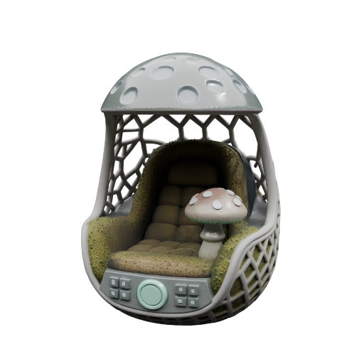
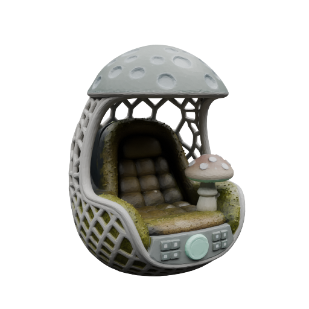
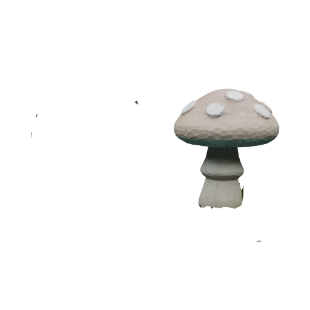
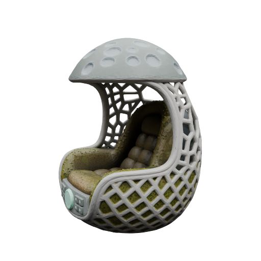
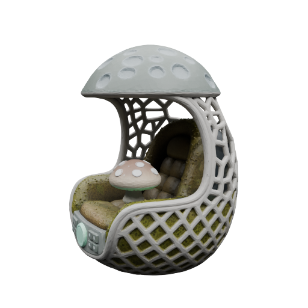

# SAM3-SegviGen（[中文](README.md)）

A text-prompted 3D part segmentation pipeline based on [SegviGen](https://github.com/Nelipot-Lee/SegviGen)
+ [SAM3](https://huggingface.co/facebook/sam3): feed it a GLB and a list of semantic prompts,
get back one GLB with one named mesh per part — real textures included.

Upstream SegviGen: [Project Page](https://fenghora.github.io/SegviGen-Page/) |
[Paper](https://arxiv.org/abs/2603.16869) |
[Online Demo](https://huggingface.co/spaces/fenghora/SegviGen) |
[Weights](https://huggingface.co/fenghora/SegviGen)

## 🌟 What this fork adds

**Recognition — semantic prompts instead of hand-painted maps.**
Upstream's 2D-guided mode needs a manually painted color map. Here SAM3 segments the
conditioning render from plain text prompts (`"helmet"`, `"body=head+face+hand"`), and the
masks are colorized into the 2D map SegviGen consumes. Prompt *groups* merge several
concepts into one output part, and `--unassigned_to` folds whatever no prompt claimed into
a named part, so the output has exactly as many parts as requested.

**Merging — every semantic object comes out as ONE mesh.**
Naive 2D guidance shatters complex shells into dozens of fragments. `segment_vote.py`
takes the other route: full (prompt-free) segmentation first, then multi-view renders are
masked by SAM3 and every *part* votes for the prompt that best covers it (a coverage
threshold stops mask bleed from hijacking large parts). Parts sharing a name are merged
into a single mesh with their textures packed into an atlas — lossless UV remapping, no
rebake.

**Automatic front-view selection.**
The 2D-guided mode is sensitive to which side of the model gets rendered. `--front_view`
picks the conditioning view automatically:

| mode | how it decides | needs |
|---|---|---|
| `metric` | silhouette symmetry + coverage + centeredness | nothing, offline |
| `auto` | metric top-3, then SAM3 prompt confidence | SAM3 env |
| `vlm` | metric top-4 grid, a VLM (Kimi/Moonshot) picks the semantic front | `MOONSHOT_API_KEY` |

**Texture baking as an option (default on).**
Each output part is re-UV'd in Blender and the source model's albedo is baked back onto it
(`--no_texture` skips Blender entirely and emits flat placeholder colors for speed).

**Robustness fixes over upstream.**
Strict legend/manifest validation with a `--sam3_only` audit mode, off-body fragment
cleanup, correct glTF V-flip and metallic-factor handling in atlas merging, and camera
conventions verified against the renderer (IoU 0.987).

## 📷 Results

Auto-selected front view → SAM3 semantic 2D map → final textured split (mushroom + chair,
exactly two meshes):

<p>
  
  
  
</p>
The two extracted parts — the mushroom alone / the chair with the mushroom removed:

<p>
  
  
  
</p>

## 🔨 Deployment

Developed and tested on Windows 11 + RTX 5090D (32 GB); upstream targets Linux with ≥24 GB
VRAM — both work. Two Python environments are required because SAM3 (transformers 5.x) and
SegviGen (transformers 4.57.6) conflict:

1. SegviGen env (the one that runs this repo): [TRELLIS.2](https://github.com/microsoft/TRELLIS.2) dependencies first
    ```sh
    git clone -b main https://github.com/microsoft/TRELLIS.2.git --recursive
    cd TRELLIS.2
    ./setup.sh --new-env --basic --flash-attn --nvdiffrast --nvdiffrec --cumesh --o-voxel --flexgemm

    pip install mathutils
    pip install transformers==4.57.6   # pinned: TRELLIS.2 issue #101
    pip install bpy==4.0.0 --extra-index-url https://download.blender.org/pypi/
    pip install --upgrade Pillow trimesh
    # Linux only: sudo apt-get install -y libsm6 libxrender1 libxext6
    ```

2. SAM3 env (a separate venv): transformers 5.x + the `facebook/sam3` weights
    ```sh
    pip install "transformers>=5"   # plus torch matching your CUDA
    ```

3. Checkpoints (~24 GB total, resume-friendly download via hf-mirror)
    ```sh
    python download_ckpts.py   # -> ckpt/full_seg.ckpt, full_seg_w_2d_map.ckpt, interactive_seg.ckpt
    ```

Runtime configuration:

- `SEGVIGEN_PY_SAM3` — Python of the SAM3 venv (default `../.venv_holo/Scripts/python.exe`).
- GPU backends (verified on Blackwell): `ATTN_BACKEND=flash_attn SPARSE_CONV_BACKEND=flex_gemm FLEX_GEMM_ALGO=explicit_gemm`.
- VLM front-view mode: `MOONSHOT_API_KEY` (env var or a gitignored `.env` at the repo
  root); `SEGVIGEN_VLM_BASE_URL` / `SEGVIGEN_VLM_MODEL` override the defaults
  (`https://api.moonshot.cn/v1`, `kimi-latest`).

## 📒 The interface

### `segment_api.py` — prompts in, one named-parts GLB out

```sh
python segment_api.py \
  --glb model.glb \
  --prompts "mushroom=small mushroom" chair \
  --unassigned_to chair \
  --front_view auto \
  --out out/parts.glb --work_dir out/work
```

- `--prompts`: one entry per output part; join concepts with `+` to merge them
  (`body=head+face+hand`), optionally under an explicit `name=` prefix. Fully user-defined,
  nothing hard-coded.
- `--front_view metric|auto|vlm`: pick the conditioning view automatically; `--azimuth`
  (degrees) remains available to pin a fixed view.
- `--no_sam`: drop SAM3 entirely and run the prompt-free full_seg checkpoint on a plain
  render (unnamed, color-clustered parts).
- `--no_texture`: skip the Blender re-UV + bake step (fast); default keeps real textures.
- `--sam3_only`: stop after render + SAM3 and keep `render.png` / `sam3_2d_map.png` /
  legend for auditing.

Python:

```python
from segment_api import segment

manifest = segment(
    "model.glb", ["mushroom=small mushroom", "chair"], "out/parts.glb",
    with_texture=True,            # texture baking is optional, default on
    front_view="auto",            # metric | auto | vlm | None
    unassigned_to="chair",
    work_dir="out/work",          # keep intermediates for inspection
)
# manifest: [{"label": 0, "name": "mushroom", "node": "part_00_mushroom", "faces": ..., ...}]
```

### `segment_vote.py` — fragment-free semantic objects via multi-view voting

For models where a single 2D guide shatters parts, vote instead of guide:

```sh
python segment_vote.py \
  --glb model.glb \
  --prompts "mushroom=small mushroom" chair \
  --unassigned_to chair --sam3_threshold 0.65 \
  --out out/merged.glb --work_dir out/vote_work
```

Pipeline: full segmentation → multi-view renders → SAM3 masks per view → per-part voting
(face-level votes pooled per part; `min_cover` guards against mask bleed) → same-name parts
merged into one mesh with a texture atlas. Output: exactly one mesh node per prompt name.

### Upstream inference scripts

The original entry points still work unchanged — interactive segmentation
(`inference_interactive.py`), full segmentation and 2D-map-guided full segmentation
(`inference_full.py`, with `--two_d_map`).

### Tests

```sh
python -m unittest discover tests
```

## ⚖️ License

This project is licensed under the [MIT License](LICENSE).
However, please note that the code in **`trellis2`** originates from the [TRELLIS.2](https://github.com/Microsoft/TRELLIS.2) project and remains subject to its original license terms.
Users must comply with the licensing requirements of TRELLIS.2 when using or redistributing that portion of the code.

## Citation

```
@article{li2026segvigen,
      title = {SegviGen: Repurposing 3D Generative Model for Part Segmentation}, 
      author = {Lin Li and Haoran Feng and Zehuan Huang and Haohua Chen and Wenbo Nie and Shaohua Hou and Keqing Fan and Pan Hu and Sheng Wang and Buyu Li and Lu Sheng},
      journal = {arXiv preprint arXiv:2603.16869},
      year = {2026}
}
``` 
