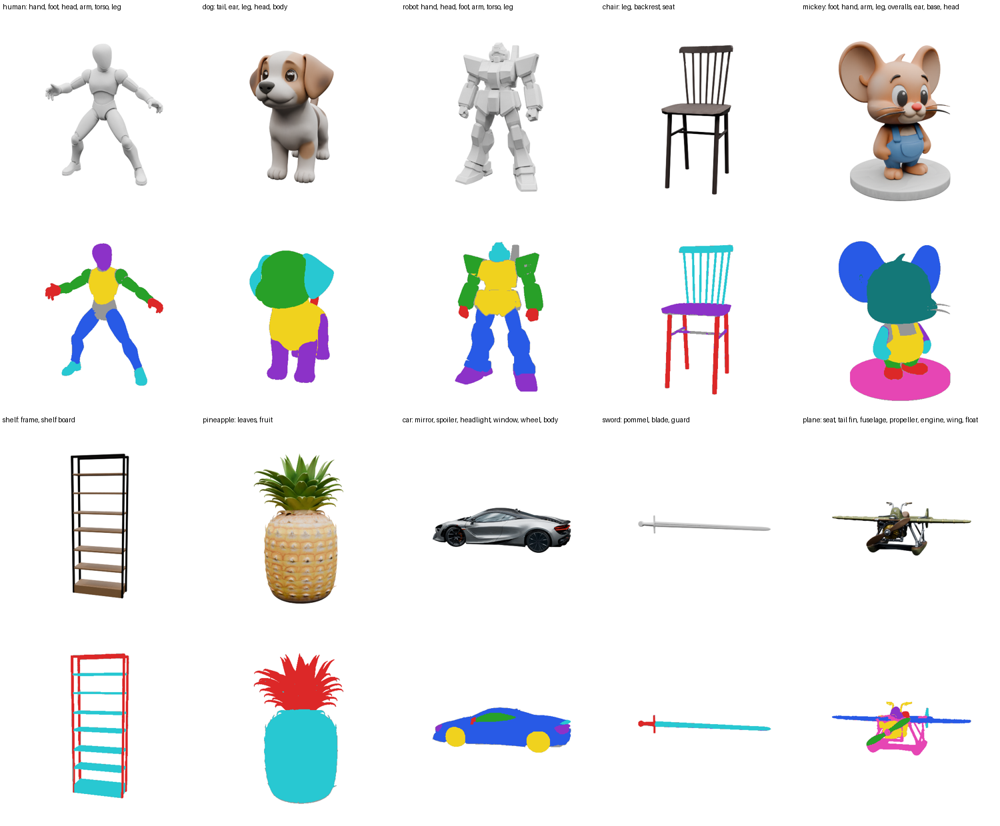
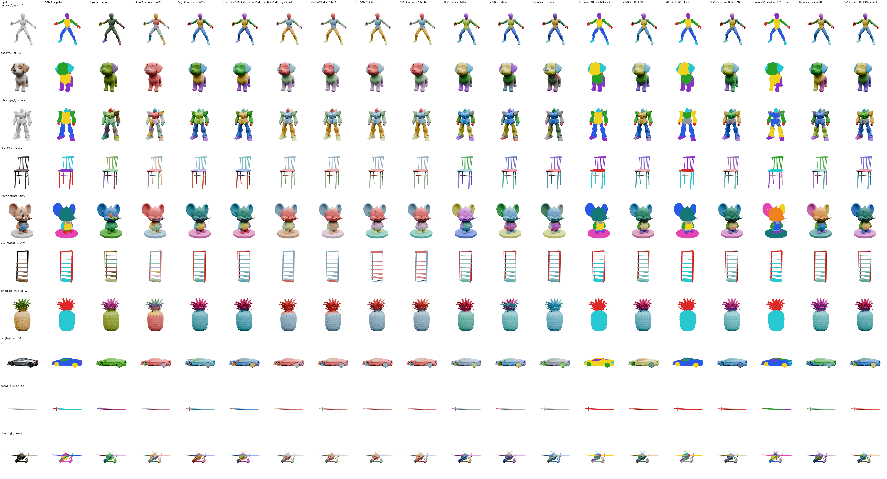
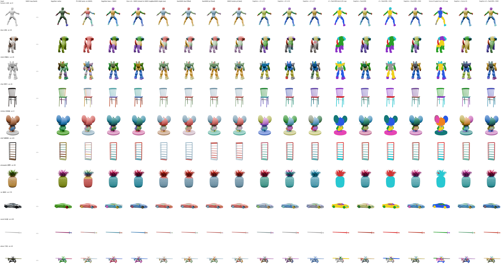

# SegviGen 语义部件分割：技术路线、训练与评测总览

整理日期 2026-09-07。本文把分散在 `REPORT_v3_changes.md`（v1–v6 过程记录）、`REPORT_geosam2_ablation.md`（GeoSAM2 消融）、`datasets/ext_bench/REPORT.md`（外部资产对照）里的内容合成一份，作为当前状态的单一入口。所有数字均来自对应的 json / log 文件，可复现命令见附录。

---

## 0. 一页摘要

**目标**：给一个 GLB，按用户给的部件名（"head, body, leg…"）把 mesh 切成**语义正确、整块、可控数量**的部件，保留原拓扑和贴图。

**路线**：SAM3（+ 我们训的概念向量库）在正面渲染上按名字出掩码 → 上色成 2D 引导图 → SegviGen（TRELLIS.2 纹理 DiT，1.3B）把配色"生成"到 3D 体素上 → 最近调色板 → 面标签。我们用 LoRA + 轨迹监督微调了 DiT（v6）。备用路线：SAM3 掩码沿 12 视角传播（SAM3 tracker 或 GeoSAM2）后反投影到面。

**当前最好结果（v6 + SAM3，hard 20 物体，有 GT）**：mIoU 0.296、边界 F1 0.704、命名正确率 0.620，逐物体 14 胜 5 负于基座；自由采样轨迹上的颜色准确率 clean 0.733 → 0.850、sam3 0.520 → 0.621。最好的提升类方法（SAM3 tracker p2 + GeoSAM2 提升）mIoU 0.276、边界 F1 0.555。

**六轮微调的核心结论**：重建损失（v-pred MSE）不约束部件归属；文本 / 图例注入四次全部失败（模型不需要读文本）；颜色布局在采样前 1–3 步就定了，teacher-forced 监督在"抄答案"；只有把监督放在采样器自己走出的轨迹上（v6）才有端到端收益。

**共同上限**：所有方法 mIoU 都在 0.2–0.3 区间，被 SAM3 的 2D 掩码质量压着（hard 集只命中 ≈85 % 的名字、掩码常吞邻件）。

---

## 1. 任务定义与验收口径

| 项 | 要求 | 对应指标 |
|---|---|---|
| 语义正确 | 每个部件带正确名字 | 语义 mIoU、命名正确率（`eval_parts`） |
| 整块 | 一个部件是一块，切口沿结构 | 边界 F1、过分割件数、碎片/段 |
| 数量可控 | 输出部件数 = 提示数 | 段数、留白 |
| 泛化 | 不针对测试模型训练 | hard 20 + 外部 10 资产均为留出 |
| 工程 | 原拓扑 / UV 不动，可拆件 | GLB 子网格导出 |

---

## 2. 技术路线总览

```
                      ┌──────────── 上游（2D 语义） ────────────┐
input.glb ─► 正面渲染 ─► SAM3 检测器 + 概念库偏移(E_0+E_name) ─► 按名字的掩码
                                                              │
                              小掩码先画 / 裁到轮廓 / 分离色调色板 / 未分配→灰
                                                              ▼
                                      2D 引导图 map.png + legend.json（颜色→名字）
                      └─────────────────────────────────────────┘
                      ┌──────────── 主干（SegviGen） ───────────┐
input.glb ─► 体素化 ─► shape_slat（几何，concat）/ input_tex_slat
map.png ─► BiRefNet 去背 ─► DINOv3 ViT-L/16 ─► ≈1029 token（cross-attn 条件）
            ─► 纹理 DiT 1.3B + LoRA r16（v6）─► 12 步 Euler（rescale_t 3，无 CFG）
            ─► output_tex_slat ─► 解码逐体素 RGB ─► 最近调色板 ─► 面标签 ─► 拆 mesh
                      └─────────────────────────────────────────┘
                      ┌──────────── 备用（提升类） ─────────────┐
12 视角渲染 ─► 锚视角 SAM3 掩码 ─► SAM3 tracker / GeoSAM2 传播到 12 视角
            ─► 深度测试反投影到面、投票 ─► 去小块 / 最近面填充 ─► 面标签
                      └─────────────────────────────────────────┘
```

两条路线的分工在 §9.3；工程化时以 SegviGen v6 为主，提升类作小件 / 背面补丁。

---

## 3. 数据集

### 3.1 PartVerse 子集（`datasets/pv/`）

| 层 | 数量 | 内容 |
|---|---|---|
| 全部对象 | 2000 | `input.glb`、`parts/*.glb`（GT 部件）、`captions.json`、重标注 `names.json`、2 视角渲染（az0 / az135）+ GT 部件 id 光栅 `ids.npy` |
| 已 prepare（可训练） | 1319 | 体素化 + SC-VAE 编码：`shape_slat.pth`、`input_tex_slat.pth`、`voxel_part.npy`、`cell_part.npz`（latent cell ↔ 部件 + 纯度） |
| 有 SAM3 变体（Path A） | 991 | `views/*/sam3_masks.npz`、`variants/sam3_*` |
| 部件 | 14 303 | 平均 7.2 / 物体；唯一名字 1558，出现 ≥8 次的 302 个覆盖 81.8 % 的实例 |

**部件名重标注**：原名字从 caption 启发式抽取，17.6 % 是 `cylindrical component` 一类占位词。用 Grok 4.6 读 caption 重标全部 14 303 个部件（91.3 % 改动），再按 `relabel/HANDOVER.md` 的口径人工审阅：抽样 12 物体 + 全库 316 个"主导部件"候选逐张目检，改 157 处；`uncertain` 标记 7.4 %。审阅样张：`../../datasets/relabel/review/dominant/sheet_00.png` 等。

### 3.2 训练变体（`variants/<kind>_<az>[_<i>]/`）

每个变体 = 一张 2D 引导图 `map.png` + `meta.json`（颜色组、灰部件、调色板）+ 3D 目标 `output_tex_slat.pth` + DINO 条件 `cond.pt`。

| kind | 数量（当前） | 2D 图怎么来 | 用途 |
|---|---|---|---|
| `clean` | 1956 | GT 部件 id 精确光栅化后按颜色组上色 | 干净监督 |
| `corrupt` | 5868 | clean + 合成扰动（边界腐蚀、漏件变灰、误绑到邻件） | 推理噪声的合成版 |
| `sam3` | 1975 | 真实 SAM3 + 概念库 v3 输出，掩码经 GT 绑定得到颜色→名字 | 推理噪声的真实版（Path A） |
| `partial` | 3884 | clean 上随机把 1–3 个可见部件（≥0.5 % 前景）抹成灰，图例仍列全部 | v4/v5 用，测"只能靠图例"的情形 |
| `sam3raw` | 20 | `sam3_to_2dmap` 部署路径原样输出（legend 绑定、无 GT） | hard 集部署口径评测 |

规则：每变体随机一套调色板（模型不能背"红 = 头"）；3D 目标按颜色组把体素重着色再过 SC-VAE，**未绑定部件涂灰**；同一物体两个视角共享 3D 目标（`target_from`）。v6 训练实际看到 9465 个变体（clean 1900 / corrupt 5700 / sam3 1865），留出 99。

### 3.3 划分

| 文件 | 数量 | 用途 |
|---|---|---|
| `pv_holdout_v3.txt` | 56 物体 | 训练留出；MSE / 颜色检查、轨迹探针（其中 20 个） |
| `pv_hard.txt` | 20 物体 | 端到端评测集（细小部件多，平均 13.6 个 GT 部件 / 8.8 个名字，112 个 <1 % 面积小件） |
| `pv_holdout_mix.txt` | 35 物体 | v1/v2 时期的留出集；回归集 |
| `pv_list_a_v3.txt` | 1028 物体 | Path A（跑 SAM3）名单 |

### 3.4 概念库训练数据

2000 物体 × 2 视角 = 4000 张渲染图，28 606 个部件实例（各视角不可见者剔除），正样本 = 同名部件并集，负样本 = 其他物体的常见名字。留出按 `concept_bank_v3/split.json`。

### 3.5 外部资产（`datasets/3D拆件.zip` → `datasets/ext_bench/`）

10 个用户模型，无 GT：human 人体、dog 小狗、robot 机器人、chair 椅子、mickey 米老鼠、shelf 置物架、pineapple 菠萝、car 跑车、sword 长剑、plane 飞机。提示词见下图标题（`ext_bench.py::ASSETS`）；200 万–500 万面的资产用 `decimate_glb.py` 减到 20 万面后再进 GeoSAM2。



---

## 4. 上游：SAM3 + 概念向量库

### 4.1 原理

SAM3 的检测器是文本条件 DETR：文本编码器给出 256 维 pooled 向量，视觉侧据此出实例掩码。它没见过"strap / visor / chest pack"这类部件名，也没见过灰材质渲染。我们不动任何 SAM3 权重，只学两组向量加在文本 pooled 向量上（`sam3_bank.py::run_prompt`）：

\[
s' = s + E_0 + E_{name}
\]

\(E_0\)（共享）负责整个渲染域的平移，\(E_{name}\)（≥8 次的 302 个名字）负责每个概念在嵌入空间的重定位，长尾名字只用 \(E_0\)。

### 4.2 训练（`concept_bank.py`，v3 = 部署版）

| 项 | 值 |
|---|---|
| 可训参数 | \(E_0\in\mathbb R^{256}\)、\(E\in\mathbb R^{302\times256}\) |
| 损失 | 正样本 BCE + Dice（软并集 vs 面积下采样 GT）+ 0.5 × 负样本 BCE(→0) + 0.5 × 存在性头 BCE + \(\lambda\|E_{name}\|^2\)，λ=1e-3 |
| 负样本 | v1 随机 / v2 难负例 / **v3 混合** |
| 优化 | Adam，lr(E) 默认、lr(E_0) 5e-4，3 epoch，10 800 步，显存 15 GB |
| 模板 | 裸 `{name}`（Stage A 对比：加 `{object}` 绑定率升但 FP 到 27 %） |

### 4.3 结果（留出集 1068 个提示）

| 阈值 | 配置 | 2D mIoU | 绑定率 | 误检率 | 难负例误检 | 部件被绑比例 | 灰像素 |
|---|---|---|---|---|---|---|---|
| 0.3 | 基线 SAM3 | 0.323 | 0.331 | 10.3 % | 28.9 % | – | – |
| 0.3 | 概念库 v3 | **0.409** | 0.419 | 12.4 % | 32.4 % | – | – |
| 0.5 | 基线 SAM3 | 0.288 | 0.301 | 5.7 % | 18.6 % | 0.429 | 0.654 |
| 0.5 | 概念库 v3 | **0.368** | 0.383 | 6.3 % | 18.8 % | **0.543** | **0.381** |

等误检率下 +0.08 mIoU，灰像素（没被任何名字认领的前景）从 65 % 降到 38 %。外部资产正面图 51 个提示命中 48 个。

### 4.4 2D 引导图构造（`sam3_to_2dmap.py::colorize`）

掩码按面积**从小到大**绘制、先占先得（body 不能吞 hand）；裁到前景轮廓（SAM3 溢出的颜色会把重网格拉出尖刺）；`pick_separated_colors` 保证颜色两两远离；未认领像素涂灰，或 `--unassigned_to` 并入指定部件（部件数恒等于提示数）。legend 记录颜色 → 名字 → 文本向量，是部署时颜色反查名字的唯一依据。

---

## 5. 主干：SegviGen

### 5.1 原理

SegviGen（arXiv 2603.16869）把 3D 生成模型当分割器：任务被表述成"把 2D 图的配色复制到 3D 表面"。基座是 TRELLIS.2 的纹理 DiT `slat_flow_imgshape2tex_dit_1_3B_512_bf16`，条件只有一路——DINOv3 对单张 512² 引导图的 patch token，通过每个 block 的 cross-attention 读入；几何 `shape_slat` 走 concat 通道。训练目标 rectified flow 速度回归：

\[
x_t=(1-t)\,x_0+\sigma_t\,\epsilon,\quad \sigma_t=\sigma_{min}+(1-\sigma_{min})t,\quad
v^\ast=(1-\sigma_{min})\,\epsilon-x_0,\quad \mathcal L_{flow}=\|v_\theta(x_t,t,c)-v^\ast\|^2
\]

**为什么整块**：去噪发生在 3D latent 上，不存在多视角标签冲突；切口位置由模型的 3D 先验决定。**为什么颜色不承载语义**：调色板随机，模型只能学"复制区域结构"。**语义唯一的入口**是 2D 图本身（和 v6 的显式颜色监督）。

### 5.2 推理设置（`microsoft/TRELLIS.2-4B/pipeline.json::tex_slat_sampler`）

| 项 | 值 |
|---|---|
| 采样器 | FlowEulerGuidanceInterval，σ_min 1e-5 |
| 步数 / 时间表 | 12 步，`rescale_t` 3 → t = 1, .971, .937, .900, .857, .808, .750, .682, .600, .500, .375, .214, 0 |
| CFG | `guidance_strength` 1.0（即不启用） |
| 检查点 | 基座 `ckpt/full_seg_w_2d_map.ckpt`；v6 合并后 `ckpt/full_seg_v6.ckpt`（`merge_lora.py`，推理零开销） |
| 单物体耗时 | 45–60 s（含体素化、DINO、采样、解码） |

### 5.3 LoRA（`lora.py`）

r=16、α=32（scale 2），B 零初始化；挂在 DiT 每个 block 的 self / cross attention 的 `to_qkv / to_q / to_kv / to_out` 上；基座全部冻结。v6 没有任何新模块，可训参数只有 LoRA。

---

## 6. 训练：v1–v6 的配置、机制与参数

### 6.1 各版本一览

| 版本 | 改动 | 条件 / 新模块 | 损失 | 数据 kinds | 步数 × 有效 batch | 时长 / 峰值显存 |
|---|---|---|---|---|---|---|
| v1 | LoRA 基线 | 单图 DINO | v-pred MSE | clean / corrupt / sam3 | 4000 × 4 | – / 8.8 GB |
| v2 | 分层 t 采样、batch ×4、接 wandb | 同上 | MSE | 同上 | 1700 (停) × 16 | 4.4 h / 11.7 GB |
| v3 | 概念库 + `LegendEncoder`（图例 token、物体名 token、第二视角） | 变长上下文 [DINO; DINO₂; obj; legend×G] | MSE | 同上 + 双视角 | 1000 × 16 | 2.3 h / 13.1 GB |
| v4 | 显式颜色 CE（单步 x̂₀）+ `partial` 变体 + 解耦图例注意力 `LegendCrossAttention` | v3 + 独立 K/V 分支 | MSE + 0.3·CE | + partial | 1500 × 16 | 4.7 h / 15.8 GB |
| v5 | 名字向量直接加到 DINO patch token | v4 去解耦注意力 + per-token 文本 | MSE + 0.3·CE | + partial | 1500 × 16 | 3.4 h / 11.7 GB |
| **v6** | **自由轨迹 rollout + 只在 t≥0.8 的颜色 CE**，回到纯图像条件 | 单图 DINO（无文本） | MSE + 0.3·CE（轨迹点） | clean / corrupt / sam3 | 1500 × 16 | 4.9 h / 12.5 GB |

### 6.2 公共超参（`runs/pv_v*/args.json`）

| 参数 | 值 | 参数 | 值 |
|---|---|---|---|
| `lora_r / lora_alpha` | 16 / 32 | `lr`（LoRA） | 1e-4，warmup 100，余弦到 1e-5 |
| `lora_targets` | self, cross | `weight_decay` | 0 |
| `batch_size × grad_accum` | 4 × 4（v1 为 4 × 1） | `grad_clip` | 1.0 |
| `p_uncond` | 0.1（条件置零） | 优化器 | AdamW β=(0.9, 0.99) |
| 时间步分布 | logit-normal(0,1)，batch 内分层 | 精度 | bf16 权重 + fp32 LoRA / 损失 |
| `holdout_file` | v1/v2 `pv_holdout_mix`(35)；v3–v6 `pv_holdout_v3`(56) | 检查 | 每 250 步，t∈{0.5, 0.95, 1.0}（v6），固定噪声 |
| v3–v5 新模块 lr | `new_lr` 1e-3（LegendEncoder）、`attn_lr` 1e-4、`out_lr` 3e-4 | dropout | 图例 0.1–0.2、第二视角 0.3 |
| v4–v6 颜色项 | `color_weight` 0.3、`color_tau` 0.03、`min_purity` 0.9 | v6 轨迹 | `p_traj` 0.5、`traj_steps` 3、`color_t_min` 0.8 |

### 6.3 颜色探针与颜色损失（v4 起，`cells.py`、`color_probe.pt`）

- `cell_part.npz`：每个 latent cell（16³ 体素块）的部件 id 与纯度；91.3 % 的 cell 纯度 ≥0.9，边界 cell 忽略（cls = −1）。
- 探针：冻结线性映射 latent[32] → RGB，跨物体拟合，留出 R² 0.906、最近调色板正确率 96.5 %（含 GREY 类 90.9 %）。让"颜色对不对"能从 latent 直接、可微读出，无需解码 VAE。
- 损失：\(\hat x_0\) 由 \((x_t, v_\theta)\) 反解，`probe(x̂₀)` 得 RGB，对调色板（颜色组 + GREY）做 \(\text{logits}_j=-\|rgb-p_j\|^2/\tau\) 的**类均衡**交叉熵（每个颜色类总权重相等，细件与主体等权）；探针在 GT latent 上本身读错的 cell（≈9 %）跳过。

### 6.4 v6 轨迹监督（`train.py::rollout`）

轨迹探针（`trajectory_probe.py`，20 个留出物体）的发现：

| 模型 / 条件 | 自由轨迹 acc t=1 → 终点 | teacher-forced acc t=1 → t≤0.9 → 终点 |
|---|---|---|
| base clean | 0.72 → 0.73 | 0.72 → 0.98 → 0.99 |
| base sam3 | 0.50 → 0.52 | 0.50 → 0.98 → 1.00 |
| base partial（抹灰 cell） | – → 0.002 | – → 1.00 |

即：颜色布局在前 1–3 步（t ≥ 0.9）决定后不再改变；teacher-forced 的 \(x_t\) 在 t=0.9 已含答案（0.92 vs 0.74）。v1–v5 所有损失都算在 teacher-forced 点上，因此 v4 的颜色 CE 4.25 → 0.84 而端到端不变。

v6 的做法：每个 micro-batch 以 `p_traj`=0.5 进入轨迹模式——对每个样本抽 k∈{0,1,2,3}，用推理采样器（同一时间表、同一 cond、无 CFG、no-grad）从纯噪声走 k 步得到采样器**自己到达**的 \(x_t\)，t = sched[k] ∈ {1, .971, .937, .900}；在该点上算 flow loss（目标速度用隐含噪声 \(\epsilon'=(x_t-(1-t)x_0)/\sigma_t\) 重算，仍指向 GT）+ 颜色 CE（仅 t ≥ 0.8）。其余 50 % 走 teacher forcing 作正则。训练窗口内 `color_acc_traj`（与推理同分布的读数）0.45–0.64 → 0.77，轨迹 flow loss 0.46 → 0.29。

---

## 7. 评测协议

| 工具 | 测什么 | 说明 |
|---|---|---|
| 留出 MSE / `color_acc_hi`（`train.py --check`） | 训练是否在学 | teacher-forced，只作训练监控，**不能**预测端到端 |
| `trajectory_probe.py` | 自由采样轨迹上每步 x̂₀ 的调色板准确率 | 唯一与推理同分布的轻量读数；20 个留出物体 |
| `eval_fidelity.py` | 输出是否保持 2D 图配色（最近邻图例色归属、边界 F1、纯度） | 隐藏 / 未覆盖 / SAM3 漏绑部件不计分，已不作验收 |
| **`eval_parts.py`** | 对**全部** GT 部件计分：mIoU（最佳匹配）、一对一 mIoU（Hungarian）、语义 mIoU（同名并集）、命名正确率、边界 F1、过 / 欠分割计数、小件召回（<1 % 面积且 IoU≥0.5）、留白 | 6 万采样点（每部件 ≥40），SegviGen 读纹理最近调色板色，外部方法读面标签，同一 GT、同一采样点 |
| `ext_bench.py score` | 无 GT：段数、碎片 / 段、留白、边界密度、方法间一致性（类无关 / 按名） | 外部 10 资产 |

---

## 8. 结果

### 8.1 留出 MSE（v1 / v2，35 物体 / 90 变体）

| 运行 | clean | corrupt | sam3 | 相对基座 |
|---|---|---|---|---|
| 基座 | 0.1657 | 0.1541 | 0.0819 | – |
| v1（4000 步） | 0.1531 | 0.1424 | 0.0754 | −7.6 / −7.6 / −8.0 % |
| v2（1500 步） | 0.1530 | 0.1426 | 0.0754 | 同上 |

LoRA 在 MSE 上的下降就是约 8 %，五分之四在前 1000 步拿到；但 3 个留出物体的颜色归属 27/28 → 26/28，fidelity 0.953 → 0.906。**MSE 与目标脱钩**。

### 8.2 v3 shuffle 对照（图例 token 是否被读）

| 检查 | 结果 |
|---|---|
| 留出 MSE，真名字 vs 随机置换名字（250/500/750/1000 步） | 到小数点后 4 位完全相同 |
| LoRA 权重相对距离 | 5.5 %（两个 run 确实不同） |
| 图例编码器权重变化 | `text_proj` 54 %、`e_obj` 150 %（收到了梯度） |

输出对图例 token 不敏感：≤10 个 token 在 ≈1000 个 DINO token 的 softmax 里权重 ≈1/1000，且损失不需要文本（gt 策略下只有 2.3 % 的 cell 属于隐藏部件）。

### 8.3 硬样本 fidelity（20 物体，`sam3_az0`，`eval_fidelity`）

| 条件 | fidelity | 正确部件数 | 边界 F1 | 纯度 | 逐物体 vs base |
|---|---|---|---|---|---|
| base | 0.617 | 6.95 | 0.751 | 0.884 | – |
| v4 无图例 | 0.605 | 6.65 | 0.683 | 0.852 | 7 / 12 |
| v4 有图例 | 0.567 | 6.15 | 0.711 | 0.871 | 7 / 12 |
| v5 有文本 | 0.185 | 2.05 | 0.568 | 0.886 | 2 / 18 |
| v5 无文本 | 0.598 | 6.60 | 0.642 | 0.865 | 5 / 15 |
| **v6** | **0.663** | – | – | – | **11 / 8** |

### 8.4 轨迹探针（20 留出物体，自由轨迹终点调色板准确率）

| 模型 | clean | sam3 |
|---|---|---|
| base | 0.733 | 0.520 |
| v4 | 0.744 | 0.603 |
| **v6** | **0.850** | **0.621** |

### 8.5 hard 20 物体 `eval_parts` 全表（同一 GT、同一采样点）

| 方法 | mIoU | 一对一 | 语义 mIoU | 命名 | 边界 F1 | 小件召回 | 留白 | 段数 | 过分割件 | 欠分割段 | 秒 |
|---|---|---|---|---|---|---|---|---|---|---|---|
| SegviGen base + SAM3 | 0.278 | 0.208 | 0.265 | 0.588 | 0.666 | 0.013 | 0.126 | 5.6 | 2.95 | 2.80 | ~45 |
| **SegviGen v6 + SAM3** | **0.296** | 0.229 | **0.274** | **0.620** | **0.704** | 0.037 | 0.129 | 5.7 | 3.10 | 2.70 | ~45 |
| SegviGen raw（部署路径，legend 绑定） | **0.304** | 0.239 | 0.219 | 0.354 | 0.668 | 0.047 | 0.142 | 6.4 | **2.65** | 2.95 | ~45 |
| GeoSAM2 single match（raw，含对面自动分割） | 0.284 | 0.238 | 0.187 | 0.342 | 0.616 | 0.070 | 0.174 | 7.3 | 4.55 | 3.25 | ~30 |
| GeoSAM2 single best filled | 0.281 | **0.250** | 0.193 | 0.363 | 0.564 | **0.080** | 0 | 8.5 | 4.30 | 4.00 | ~30 |
| GeoSAM2 dual match filled | 0.264 | 0.213 | 0.211 | 0.447 | 0.599 | 0.037 | 0 | 7.1 | 4.05 | 3.45 | ~20 |
| SAM3 ×1 直接提升（无传播） | 0.209 | 0.165 | 0.164 | 0.341 | 0.392 | 0.024 | 0 | 6.5 | 5.0 | 3.3 | 8.6 |
| SAM3 ×4 直接提升 | 0.244 | 0.192 | 0.207 | 0.416 | 0.555 | 0.041 | 0 | 7.8 | 5.4 | 3.5 | 8.7 |
| SAM3 ×12 直接提升（无 SAM2） | 0.230 | 0.182 | 0.209 | 0.431 | 0.560 | 0.041 | 0 | 8.1 | 5.5 | 3.6 | 7.8 |
| GeoSAM2 传播 p1 / p2 / p4 | 0.246 / 0.254 / 0.249 | 0.197 / 0.205 / 0.197 | 0.182 / 0.216 / 0.215 | 0.375 / 0.425 / 0.385 | 0.549 / 0.549 / 0.508 | 0.050 / 0.037 / 0.037 | 0 | 6.2 / 7.4 / 7.3 | 4.5 / 5.7 / 4.0 | 2.6 / 3.5 / 3.5 | 14 / 19 / 31 |
| SAM3 tracker 传播 p1 / **p2** / p4 | 0.248 / **0.276** / 0.259 | 0.194 / 0.220 / 0.207 | 0.178 / 0.230 / 0.217 | 0.380 / 0.415 / 0.423 | 0.523 / 0.555 / 0.557 | 0.046 / **0.074** / 0.046 | 0 | 6.2 / 7.5 / 7.8 | 3.9 / 4.4 / 4.8 | 3.0 / 3.5 / 3.4 | 17 / 11 / 15 |

逐物体 mIoU：v6 vs base **14 / 5**；SAM3 tracker p2 vs v6 9 / 11、vs GeoSAM2 传播 p1 13 / 7。

读法：
1. 所有方法 mIoU 0.21–0.30，一个部件 IoU≥0.5 的只有 2–2.7 个 / 13.6 个——上限在 SAM3 2D 掩码。
2. v6 是唯一在所有主指标上优于基座的 SegviGen 版本，边界 F1（0.70 vs ≤0.62）和命名（0.62 vs ≤0.45）领先所有提升类方法。
3. 命名上 base / v6 有 GT 绑定帮忙；与 GeoSAM2 公平比较看 raw 行：语义 mIoU 0.219 vs 0.19–0.23，基本打平。
4. 提升类方法赢在小件召回（0.07–0.08 vs 0.01–0.05）和速度（8–20 s）。
5. 传播（任何一种）比多跑 SAM3 强；几何分支（GeoSAM2）相对零训练的 SAM3 tracker 没有可测增益；2 个提示视角是甜点。

### 8.6 外部资产（10 个，无 GT）：结构统计

`ext_bench.py score` 9-07 重跑（表面采样无固定种子，段数 / 碎片数有 ±0.1–0.4 抖动；消融行取自 `ablation_scores.json`）：

| 方法 | 段数 | 碎片/段 | 留白 | 边界密度 | 与 v6 一致（类无关 / 按名） | 秒 |
|---|---|---|---|---|---|---|
| SegviGen 原生 `full_seg`（无 SAM3，无名字） | 5.7 | 1.59 | 0 | **0.019** | 0.51 / – | 65 |
| P3-SAM 原版 auto-mask（无 SAM3，无名字） | 13.9 | **1.02** | 0 | 0.058 | 0.43 / – | **24** |
| SegviGen base + SAM3 | 4.4 | 1.94 | 0.04 | 0.034 | 0.86 / 0.75 | 52 |
| **v6 + SAM3** | 4.7 | 2.07 | 0.03 | 0.040 | – | 49 |
| GeoSAM2 single（raw，旧流程） | 5.1 | 1.53 | 0.08 | 0.051 | 0.72 / 0.55 | 75 |
| GeoSAM2 dual（填充，旧流程）† | 4.7 | 1.83 | 0 | 0.037 | 0.71 / 0.56 | 89 |
| GeoSAM2 传播 p2（修正） | 4.9 | 2.58 | 0 | 0.039 | 0.82 / 0.67 | 57 |
| SAM3 tracker p2 | 4.9 | 2.50 | 0 | 0.039 | 0.79 / 0.65 | 54 |
| SAM3 ×12 直接提升 | 4.9 | 2.69 | 0 | 0.052 | 0.80 / 0.68 | 48 |

† dog / mickey / pineapple / shelf 受 GeoSAM2 变换顺序 bug 影响（§9.2）。

P3-SAM（Hunyuan3D-Part，`E:\p3part\P3-SAM\demo\auto_mask.py`，Sonata 骨干 108 M，100k 采样点、400 个 FPS 点提示、阈值 0.95、含默认后处理；
经 `finetune/p3sam_run.py` 跑在与 GeoSAM2 相同的 ≤200k 面网格上）是纯几何部件先验的参照：逐资产段数 human 20 / dog 4 / robot 31 / chair 16 /
mickey 10 / shelf 10 / pineapple 7 / car 7 / sword 5 / plane 29，10 个里 8 个每段都是整块。

### 8.7 定性图

正面（列：输入 / SAM3 图 / SegviGen 原生 / **P3-SAM 原版** / base+SAM3 / **v6+SAM3** / GeoSAM2 single raw / GeoSAM2 dual 填充(旧) / GeoSAM2 p2 修正 / SAM3 tracker p2）：



背面（同列序；SAM3 只看过正面，背面全靠各方法自己补）：



观察：
- **v6 相对 base**：多找回小件（米老鼠 ear / foot、飞机 propeller）、留白更少（机器人 0.08 → 0.02），碎片略多；跑车 / 米老鼠背面未观测的轮子、后脑更易变色。
- **SegviGen 原生**是另一套划分：有机体极粗（小狗 3 段）、人造物按几何拆细（椅子 10 段），块整但无名字、不受控。
- **P3-SAM 原版**给的是关节级 / 零件级的过分割：人体按头、胸、腹、上臂、前臂、手、大腿、小腿、脚拆成 20 段，椅子每根撑条一段，菠萝叶冠拆成多簇，
  每段几乎都是整块（碎片/段 1.02）、20–30 s 最快；但软过渡的有机体切不开（小狗头、身、四腿一块，只分出耳朵，与 SegviGen 原生一致 0.75），
  粒度比用户提示细一档、没有名字、无法按提示合并（与 v6 一致仅 0.43）。它适合作"候选切口"（先过分割再按 SAM3 名字合并），不适合作最终输出。
- **提升类**正面与 v6 一致（0.8），背面靠传播 + 最近面填充：重复部件（4 个轮子）颜色一致是优势，后脑 / 后腿出现异色补丁、薄件（飞机、剑）碎。
- 消融各列（GeoSAM2 p2 vs SAM3 tracker p2）肉眼几乎无差别，与 §8.5 一致。
- 消融列的颜色按提示序号固定分配，不是 SAM3 图的调色板（shelf 的框架 / 层板在两组列里颜色互换是正常的）。

更多图：每资产 512 分辨率正 / 背面 `../../datasets/ext_bench/detail/<key>.png`；全部消融行 `../../datasets/ext_bench/ablation_front.png` / `ablation_back.png`；早期小狗 / 椅子三路对照 `../../datasets/geosam2/ext_vis/ext_compare.png`。这些 `../../datasets/` 路径指向仓库外的本地数据目录；上面三张内联图已随仓库放在 `assets/ext_bench/`。

### 8.8 逐版本结论

| 版本 | 结论 |
|---|---|
| v1 / v2 | LoRA + MSE：MSE −8 %、颜色归属变差。重建损失不约束归属 |
| v3 | 图例 / 物体名 token：shuffle 无差别。模型不读文本 |
| v4 | 单步颜色 CE：训练 CE 4.25 → 0.84，端到端不变。teacher forcing 在抄答案；解耦注意力零差距 |
| v5 | 逐 token 名字：带文本崩到 0.19。名字被当"该上色"开关 |
| **v6** | 轨迹监督：探针 +0.12 / +0.10，mIoU +0.018、边界 F1 +0.038、命名 +3.2 点、14/5。唯一全面优于基座 |

---

## 9. GeoSAM2 路线

### 9.1 架构与训练配方（论文 + `ckpt/geosam2.pt` 1119 张量，≈155 M）

| 模块 | 参数 | 说明 |
|---|---|---|
| `image_encoder.trunk`（normal 图） | 68.8 M | SAM2.1 Hiera B+，每 block 注意力 Q/K/V 上 LoRA r=4 |
| `pos_map_encoder.trunk`（position 图） | 68.8 M | 第二份 Hiera B+ + 独立 LoRA |
| `feature_fusion.fusion_{low,mid,high}` | 3 × 1.2 M | 零初始化 3×3 卷积，逐 FPN 层残差融合两路特征 |
| memory attention / encoder、mask decoder、prompt encoder | ≈12 M | SAM2 原件，冻结（仅 IoU 头可训） |

训练：约 4700 个自标注物体，**按网格连通性分解得部件**（非语义）；12 视角 1024² normal / position / depth 排成"视频"；SAM2 标准损失；50 epoch、8 × A800、batch 8、lr 5e-5。仓库只有推理代码。

### 9.2 接入与修复（Windows，`.venv_geosam2`）

- `opencv-python` 5.0 无 OpenEXR（深度图读成 None）→ 4.14；`mode_ext` C++ 扩展无 MSVC → torch `scatter_add` 回退。
- 渲染：`finetune/geosam2_render.py` 复用其相机 / 归一化，修 Blender 4.1 的 `use_auto_smooth`，view transform 设 Standard。
- 掩码：`finetune/geosam2_masks.py` 在其 12 视角渲染上跑 SAM3 + 概念库 v3，写标签图（小掩码先画）。
- 驱动：`geosam2_run.py`（single：1 提示视角 + 对面自动分割）、`geosam2_dual.py`（v 与 v+6 两张标签图作提示）；`*_filled.npy` 把留白按最近已标面填充以与 SegviGen 同口径；`geosam2_to_glb.py` 转回原坐标系导出可拆件 GLB。
- **变换顺序 bug**：`prepare_mesh_and_point_cloud` 先平移后缩放，渲染器是先缩放后平移；bbox 中心不在原点的资产（dog 偏移 −0.42、缩放 0.94）1e-3 深度测试只剩 9 % 的面通过。修正后 0.92（`geosam2_ablate.prepare_mesh`、`GeoSAM2/inference.py`）。hard 集偏移为 0 不受影响。
- `complete_labels` 的连通块重编号用 0 维张量做字典键，实际永不触发（`faces_inst.npy` ≡ `faces.npy`）。
- 200 万–500 万面资产直接跑会申请 182 GB 内存，须先 `decimate_glb.py` 减到 20 万面。

### 9.3 消融（`geosam2_ablate.py`、`sam3_track.py`）

所有行共享 GeoSAM2 的提升（每面 5 点 1e-3 深度测试 → 逐点跨视角众数 → 面投票）和后处理（去小块、邻接填充、最近面填充），只换 12 视角 2D 标签图的来源：`sam3_pK`（K 个均匀视角各跑 SAM3，不传播）、`geo_pK`（K 个提示视角，GeoSAM2 传播，K 次结果逐像素多数票）、`lift:sam3track_pK`（同样提示，`facebook/sam3` 的 `Sam3TrackerVideoModel`，PE 骨干、RGB、无几何、零训练；以锚视角为中心正反两半圈各跑一次，重叠帧 logits 平均）。结果见 §8.5 / §8.6。

**SAM2 → SAM3**：权重不能直接换（LoRA / 融合形状绑定 Hiera 四个 stage，SAM3 是单尺度 PE ViT）；传播环节换成 SAM3 tracker 零训练即可，hard 集 p1 +0.002、p2 +0.022、p4 +0.010 mIoU，小件召回翻倍，10 s/物体。逆向训练可行（Meta `sam2/training` + PartVerse 语义部件 + 现有渲染器，从其权重续训 1–2 天），但消融显示传播不是短板；SAM3 tracker 的训练配置未公开（issue #470）。SAM 3.1 tracker 可零成本替换。

**两条路线的分工**：

| | SegviGen v6 | 提升类（SAM3 tracker p2 + GeoSAM2 提升） |
|---|---|---|
| 边界 / 整块 | 生成式，切口跟随 3D 结构，F1 0.70 | 2D 边界投影到面，F1 0.55，薄件碎 |
| 命名 | 0.62 | 0.42 |
| 小件 | 0.037 | 0.074 |
| 背面 | 模型补全，整体一致 | 传播 + 填充，异色补丁 |
| 可控性 | 单张正面图 | 每视角可加 / 删提示 |
| 时间 / 依赖 | 45–60 s / 我们的 LoRA | 10 s / 零训练 |

---

## 10. 结论与下一步

**结论**：语义部件分割的可用方案是 SAM3 + 概念库 → SegviGen v6。它在有 GT 的 hard 集上所有主指标最好，整块性（边界 F1）是结构性优势；提升类方法零训练、快、小件好，但边界和命名差一档。两条路线共同的天花板是 SAM3 的 2D 掩码质量。

**下一步（按收益 / 成本，详见 `REPORT_v3_changes.md` §12.4）**：

1. **v7 = v6 加码**：`p_traj` 0.5 → 0.8、`traj_steps` 3 → 6、sam3 变体加权 ×2；目标 sam3 轨迹 acc 0.62 → 0.70+。
2. **训练条件换成部署分布**：sam3 变体用 `sam3_to_2dmap` 原样输出（legend 绑定、含错绑与灰区）作条件，3D 目标仍按 GT——让模型学"纠正 2D"而非"复制 2D"（部署命名 0.354 vs GT 绑定 0.588 的差距来源）。
3. **推理端面图 graph cut**（零训练）：调色板距离 unary + 二面角 pairwise，同色小块并入邻块；碎片 2.1 → ≈1.2。
4. **背面作第二条件图**：SAM3 tracker 把正面掩码传到背面，双视角 token 拼接；在 v6 机制下重测 v2/v3 无效的双视角。
5. **上游 2D**：概念库难负例、tracker 回投做多视角一致修正、细杆高分辨率 tile。
6. **小件兜底**：v6 主分割 + tracker p2 在块内做面级名字投票。
7. **不再做**：文本 / 图例注入、DINOv3 微调、GeoSAM2 重训。

门槛：`eval_parts` hard 20 的 mIoU / 边界 F1 / 碎片，35 个回归物体 −1 点以内；不再用 fidelity 验收。

---

## 附录 A. 文件索引

| 路径 | 内容 |
|---|---|
| `finetune/REPORT_v3_changes.md` | v1–v6 全过程记录（§0 原理、§6 损失、§7–9 v4–v6、§10–12 评测与路线） |
| `finetune/REPORT_geosam2_ablation.md` | GeoSAM2 消融与三个路线问题的评估 |
| `datasets/ext_bench/REPORT.md` | 外部资产对照自动报告 + `notes.md` 观察 |
| `datasets/geosam2/eval/results.json`、`ablation.json`、`ablation_tables.md` | hard 20 的全部分数 |
| `datasets/ext_bench/scores.json`、`ablation_scores.json` | 外部资产结构统计 |
| `finetune/runs/pv_v*/{args.json, log.jsonl}` | 各版本训练参数与日志；wandb 项目 `segvigen-sam3` / `segvigen-finetune` |
| `datasets/concept_bank_v3/{bank.pt, log.jsonl, text_cache.pt}` | 概念库 v3 |
| `datasets/relabel/` | 重标注产物与审阅记录（`HANDOVER.md`） |

## 附录 B. 主要脚本

| 脚本 | 作用 |
|---|---|
| `sam3_to_2dmap.py`（仓库根） | SAM3 + 概念库 → 2D 引导图 + legend |
| `finetune/concept_bank.py`、`sam3_bank.py` | 概念库训练 / 加载 |
| `finetune/render_views.py`、`prepare_object` / `run_batch.py` | 渲染 + GT id 光栅；体素化 + 编码 |
| `finetune/dataset.py`、`cells.py`、`color_probe.py` | 变体数据集、latent cell 目标、颜色探针 |
| `finetune/train.py`、`lora.py`、`merge_lora.py` | 训练（含 rollout / 颜色 CE）、LoRA、合并 |
| `finetune/trajectory_probe.py` | 自由轨迹颜色读数 |
| `finetune/eval_parts.py`、`eval_fidelity.py` | 3D 评测 |
| `finetune/ext_bench.py`、`decimate_glb.py` | 外部资产多方法对照、减面 |
| `finetune/geosam2_render.py`、`geosam2_masks.py`、`geosam2_run.py`、`geosam2_dual.py`、`geosam2_to_glb.py` | GeoSAM2 接入 |
| `finetune/p3sam_run.py`、`run_p3sam.bat` | 原版 P3-SAM auto-mask（跑在 `.venv`，补装 addict / fpsample / numba / scikit-learn） |
| `finetune/sam3_track.py`、`geosam2_ablate.py`、`ablation_score.py` | SAM3 tracker 传播、消融、打分 |

## 附录 C. 复现命令

```bat
REM 概念库 v3
finetune\run_ft.bat concept_bank.py --dataset_root datasets\pv --out datasets\concept_bank_v3 --template name --epochs 3 ^
    --neg_mode mixed --negatives 3 --neg_weight 0.5 --lr_e0 5e-4 --holdout_file datasets\pv_holdout_v3.txt

REM v6 训练（1500 步，约 5 h，12.5 GB）
finetune\train_loop.bat 3 finetune\runs\pv_v6 --kinds clean corrupt sam3 --color_probe finetune\color_probe.pt ^
    --color_weight 0.3 --color_tau 0.03 --color_t_min 0.8 --p_traj 0.5 --traj_steps 3 ^
    --batch_size 4 --grad_accum 4 --max_steps 1500 --check_ts "0.5,0.95,1.0" --wandb
finetune\run_ft.bat merge_lora.py --lora finetune\runs\pv_v6\lora_final.pt --out ckpt\full_seg_v6.ckpt

REM 部署推理
python sam3_to_2dmap.py --image render.png --prompts head body leg --concept_bank datasets\concept_bank_v3\bank.pt --out map.png --legend legend.json
python inference_full.py --ckpt_path ckpt\full_seg_v6.ckpt --glb input.glb --input_vxz input.vxz --img map.png --two_d_map --export_glb out.glb

REM 评测（单物体；hard 20 的批量表由 geosam2_chain / ablation_score 生成）
finetune\run_ft.bat eval_parts.py --object datasets\pv\<id> --segvigen out.glb --legend legend.json --report out.json
finetune\run_ft.bat eval_parts.py --object datasets\pv\<id> --faces mesh.glb --face_labels faces.npy --labels_json labels.json
finetune\run_ft.bat ext_bench.py all                  REM 含 p3sam 阶段；单独：ext_bench.py p3sam score montage report
finetune\run_ft.bat ablation_score.py hard / ext / tables
```
